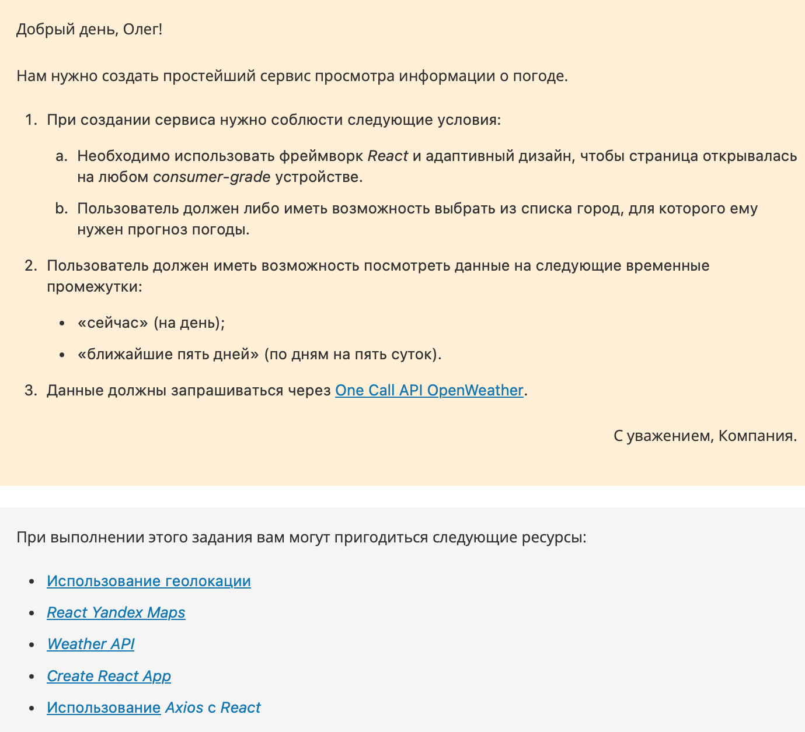
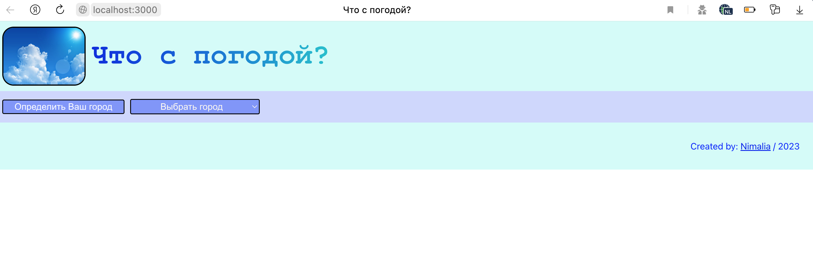
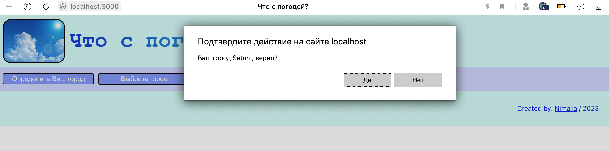
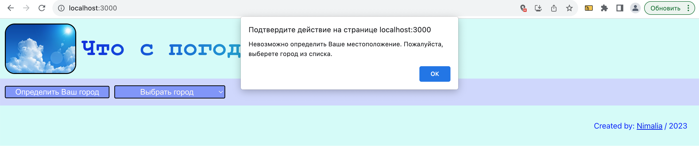
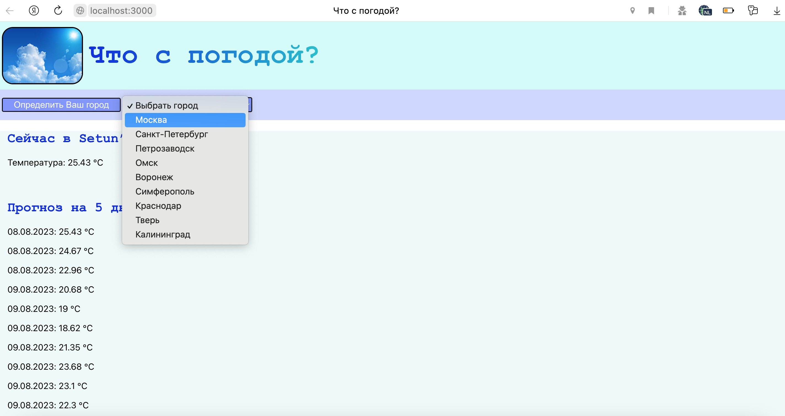

Привет, меня зовут **Алина** 👋

Учусь на курсе  

**Fullstack разработчик на Python**
 

Блок **Frontend-разработка**
# The weather is....☀️


[](https://git.io/typing-svg)
___


**Задание:**



**Проект:**


### **Быстрый старт:**

1. Вставьте в ```App.js``` свой ключ ```API_KEY```
2. Перейдите в директорию React приложения, используя команду
 ```bash
cd weather
```
3. Для успешного запуска приложения, вам необходимо находиться в корневой директории проекта, где находится файл ```package.json```. Если вы получаете ошибки, убедитесь, что вы находитесь в правильной директории и у вас установлены все необходимые зависимости, выполнив 
```bash
npm install
```
4. После того как вы находитесь в директории вашего приложения, выполните команду:

```bash
npm start
```


### **Структура приложения:**

1. Изначально приложение выглядит таким образом:


2. Нажав на кнопку "Определить Ваш город", произойдет автоматическое определение геолокации, где нужно будет подтвердить оперделившийся город. В случае если геолокацию определить не удасться, то будет выведено соответсвующее сообщение:



3. Так же можно выбрать город из предложенного списка:
   


**🛠️Технические нюансы🔩**

1. Для отображения погоды использовался  [One Call API OpenWeather](https://openweathermap.org/api).

2. При отображении погоды на 5 дней сервис [API OpenWeather](https://openweathermap.org/forecast5) выдает на 5 дней, но каждые 3 часа. Поэтому пришлось выводить среднюю арифметическую температуры по каждому дню. Для этого в Main.js:
```bash
const calculateAverageTemperature = (temperatures) => {

const sum = temperatures.reduce((total, temp) => total + temp, 0);
    
return sum / temperatures.length;
};    
```

3. Для определения геолокации использовался ```Geolocation API```

4. Разметка страницы делиться на :
- ```header```
- ```nav```
- ```main``` (разворачивается при определении геолокации, либо при выборе города)
- ```footer```

все это вынесено в отдельные js файлы: 
```bash
Header.js
Nav.js
Main.js
Footer.js
```
также вынесен функционал в отдельные компоненты:
```bash
CitySelector.js /*выбор города из списка*/
CurrentWeather.js /*отображение текущей погоды*/
Forecast.js /*отображение погоды на 5 дней*/
GeolocationDetectes.js /*определение текущей локации*/
```
все эти компоненты импортируются и собираются в общий файл - App.js

5. Возник вопрос, как спрятать API_KEY? Конечно при помощи .env, инструкции [здесь](http://fkn.ktu10.com/?q=node/16507)

❌ но у меня, на данный момент, с .env не получилось, причины выясняются...

----
```` Спасибо за уделенное время! 🙏 ````

___


[](https://github.com/anuraghazra/github-readme-stats)